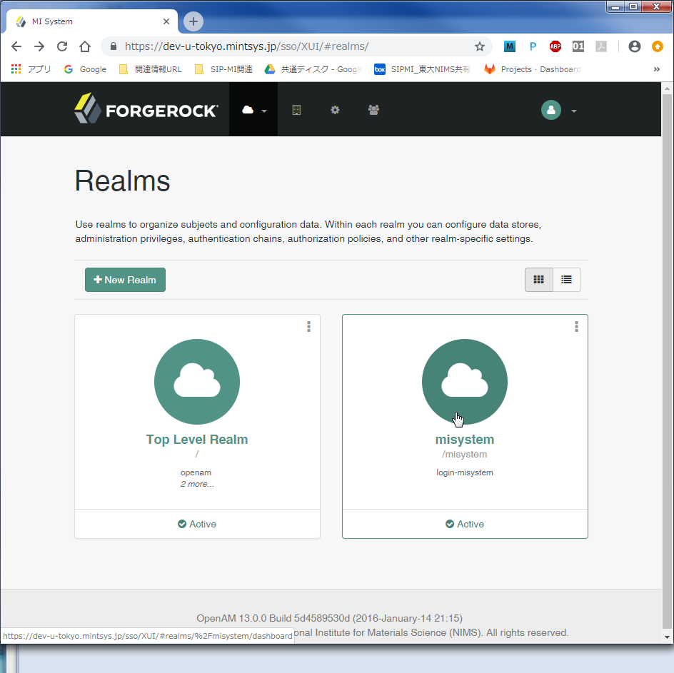

概要
====

MIシステムのマルチテナントに対応したユーザー認証システムとして、LDAPとOpenAMを使用したSSO(イングルサインオン）を採用した。他方、WF-APIなど各種API使用時には簡易認証方式として登録してあるアクセストークンを使用することになっている。このトークンをAPIゲートウェイのDBに使用するAPIごとに登録し、API使用時登録の有無で使用可能かどうかの認証を行っている。このためAPI使用者は予めこのトークンを入手（ユーザープロファイル画面などから）しておく必要があるが、APIはWEBで実行するだけとは限らず、特にWF-APIではpythonスクリプトなど外部プログラムのみで実行することが多い。このためトークンを入手せず、せっかくあるSSOのシステムを利用し、正式な認証を行いトークンを入手する方法を用意することとした。本書ではこのための手順を記述する。

システム概要
============

実行環境
--------

python（２または３）を想定し、OSはLinux/MacOS/Windowsのどれでも可能とする。またpythonを単独実行しシェルスクリプトでも使えるようにする。pythonではライブラリとしての使用を想定する。

準備
====

手順
----

本ライブラリによる認証はOpenAMのREST
APIを使用して実施されます。そのためOpenAMにOpenID
Connectの設定が必要になります。参考にしたページは以下です。
`OpenAMのREST-APIメモ（認証、アクセストークン、リフレシュトークン） <https://qiita.com/hakozaki/items/12d1c454c2f9f33a28eb>`__
`OpenID Providerの実装例～OpenAM～ <https://www.ogis-ri.co.jp/otc/hiroba/technical/openid-connect/chap2.html>`__
`AWS IAMとOpenAMを連携してアカウント管理を効率化してみた <https://www.ogis-ri.co.jp/otc/hiroba/technical/openid-connect/chap4.html>`__
`OpenAMから認可コードフローを使ってID連携を試す <https://qiita.com/nanazero/items/56d6bc70b7348dce1aca>`__

手順は以下のとおりです。 
- OpenAMにOAuth2プロバイダを作成
- OAuth2.0クライアントとしてエージェントを作成
- 作成したエージェントにいくつかの設定
- デフォルトで取得できるClaim（LDAPの項目）の追加

OpenID Connectの設定
--------------------

1. OpenAMの設定WEBへログインし、misystemレルムを選択します。

2. OAuthプロバイダーの構成を選択し、 |config-oauthp.png|
3. OpenID Connectの構成を選択します。 |config-openid.png|
4. 特に何もせず、作成するを押下します。 |openid-create.png|
5. 了解を押下します。 |openid-confirm.png|
6. OAuth2プロバイダができているのを確認しします。 |check-oauth2p.png|

OAuth2クライアントの作成
------------------------

1. misystemレルムからAgentsをクリックします。 |agents.png|
2. OAuth2クライアントをクリックします。 |oauth2client.png|
3. 新規にエージェントを作成します。エージェントの新規を押下します。
   |image.png|
4. 名前に「sipauthApp」パスワードはPから始まるいつものを設定し、作成を押下します。
5. エージェントにsipauthAppが追加されたのを確認する。 |image.png|

エージェントの設定
------------------

1. misystemレルムからAgentをクリックし、OAuth2
   クライアント->sipauthAppをクリック。

-  リダイレクトURIの設定

   -  以下のどれかを設定する。
   -  https://u-tokyo.mintsys.jp(東大運用側)
   -  https://mins.mintsys.jp(NIMS)
   -  https://dev-u-tokyo.mintsys.jp(東大開発側)
   -  https://ut-remote.mintsys.jp(東大リモート環境)

-  スコープの設定

::

    openid
    profile
    qualified
    email

を設定しておく

設定が終わったら右上の保存を押下して、保存する。

-  一旦OpenAMの再起動

::

    # systemctl restart tomcat@openam

-  endopointなどの確認
   WEBブラウザで、https://xxxx.mintsys.jp/sso/oauth2/.well-known/openid-configuration?realm=misystem
   として、以下のようなページ表示が行われれば設定はおおむね大丈夫。
   chromeの表示

::

    {"response_types_supported":["code token id_token","code","code id_token","id_token","code token","token","token id_token"],"claims_parameter_supported":true,"end_session_endpoint":"http://dev-u-tokyo.mintsys.jp:80/sso/oauth2/misystem/connect/endSession","version":"3.0","check_session_iframe":"http://dev-u-tokyo.mintsys.jp:80/sso/oauth2/misystem/connect/checkSession","scopes_supported":["address","phone","openid","profile","email"],"issuer":"http://dev-u-tokyo.mintsys.jp:80/sso/oauth2/misystem","acr_values_supported":[],"authorization_endpoint":"http://dev-u-tokyo.mintsys.jp:80/sso/oauth2/misystem/authorize","userinfo_endpoint":"http://dev-u-tokyo.mintsys.jp:80/sso/oauth2/misystem/userinfo","claims_supported":["zoneinfo","address","profile","name","phone_number","given_name","locale","family_name","email"],"jwks_uri":"http://dev-u-tokyo.mintsys.jp:80/sso/oauth2/misystem/connect/jwk_uri","subject_types_supported":["public"],"id_token_signing_alg_values_supported":["HS256","HS512","RS256","HS384"],"registration_endpoint":"http://dev-u-tokyo.mintsys.jp:80/sso/oauth2/misystem/connect/register","token_endpoint_auth_methods_supported":["client_secret_post","private_key_jwt","client_secret_basic"],"token_endpoint":"http://dev-u-tokyo.mintsys.jp:80/sso/oauth2/misystem/access_token"}

Firefoxの表示 |endpoint-firefox.png|

デフォルトClaimの編集
---------------------

1. misystemレルムからScrpitsをクリックします。 |realm-script.png|
2. OIDC Claims Scriptをクリックします。 |claim-script.png|
3. スクリプト編集ウィンドウの中ほどを以下のように編集します。
   |claim-script-window.png|

claimAttributesに取得方法を追記し、scopeClaimsMapにprofileスコープにmi-user-idとmi-api-tokenを追加します。

::

    claimAttributes = [
            "email": attributeRetriever.curry("mail"),
            "address": { claim, identity, requested -> [ "formatted" : attributeRetriever("postaladdress", claim, identity, requested) ] },
            "phone_number": attributeRetriever.curry("telephonenumber"),
            "given_name": attributeRetriever.curry("givenname"),
            "zoneinfo": attributeRetriever.curry("preferredtimezone"),
            "family_name": attributeRetriever.curry("sn"),
            "locale": attributeRetriever.curry("preferredlocale"),
            "name": attributeRetriever.curry("cn"),
            "mi-user-id": attributeRetriever.curry("mi-user-id"),
            "mi-api-token": attributeRetriever.curry("mi-api-token")  
    ]

    // {scope}: [ {claim}, ... ]
    scopeClaimsMap = [
            "email": [ "email" ],
            "address": [ "address" ],
            "phone": [ "phone_number" ],
            "profile": [ "given_name", "zoneinfo", "family_name", "locale", "name", "mi-user-id", "mi-api-token" ]
    ]

編集が終わったら、右下の「Save」を押下します。

プログラムの配置
----------------

適当な場所で、「git clone
ssh://git@gitlab.mintsys.jp:50022/midev/authentication-operator.git」を実行して、プログラムを取り出します。

必要なライブラリ
----------------

特にありません。

プログラムの使用法
==================

コマンドライン
--------------

シェルスクリプトなどでの使用を想定しています。

::

    $ python openam-operator.py u-tokyo.mintsys.jp utadmin001 <パスワード>

と実行します。
失敗した場合（パスワードが違う、ユーザーIDが違うなど）は以下のようになります。また実行結果として１が返ります。

::

    Faild(Unauthorized)

成功すれば、

::

    ID <mi-user-id>
    Token <mi-api-token>

となります。

ライブラリ
----------

pythonのライブラリとしての実行も想定しています。

-  インポート

.. code:: python

    from openam_operator import *

-  実行 miauth(server, username, password) server :
   u-tokyo.mintsys.jpのような文字列。 username :
   utadmin001のような文字列 password : パスワード

.. code:: python

    >>> miauth("ut-remote.mintsys.jp", "utadmin001", "間違ったパスワード")
    (False, <Response [401]>, None)
    >>> miauth("ut-remote.mintsys.jp", "utadmin001", "正しいパスワード")
    (True, u'500000100000001', u'13bedfd69583faa62be240fcbcd0c0c0b542bc92e1352070f150f8a309f441ed')

※python2.7での実行結果。

.. |realm-define.png| image:: http://192.168.1.34:3000/files/5be1205d4943485079c50fef
.. |config-oauthp.png| image:: http://192.168.1.34:3000/files/5be122d74943485079c50ff1
.. |config-openid.png| image:: http://192.168.1.34:3000/files/5be122a14943485079c50ff0
.. |openid-create.png| image:: http://192.168.1.34:3000/files/5be1231f4943485079c50ff2
.. |openid-confirm.png| image:: http://192.168.1.34:3000/files/5be123574943485079c50ff3
.. |check-oauth2p.png| image:: http://192.168.1.34:3000/files/5be123a64943485079c50ff4
.. |agents.png| image:: http://192.168.1.34:3000/files/5be1244b4943485079c50ff6
.. |oauth2client.png| image:: http://192.168.1.34:3000/files/5be1240d4943485079c50ff5
.. |image.png| image:: http://192.168.1.34:3000/files/5be125884943485079c50ff8
.. |image.png| image:: http://192.168.1.34:3000/files/5be125f64943485079c50ff9
.. |endpoint-firefox.png| image:: http://192.168.1.34:3000/files/5be1321f4943485079c50fff
.. |realm-script.png| image:: http://192.168.1.34:3000/files/5be12c644943485079c50ffb
.. |claim-script.png| image:: http://192.168.1.34:3000/files/5be12ca34943485079c50ffc
.. |claim-script-window.png| image:: http://192.168.1.34:3000/files/5be12d754943485079c50ffd

